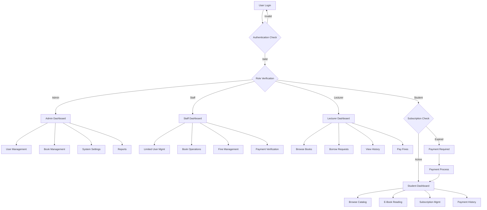
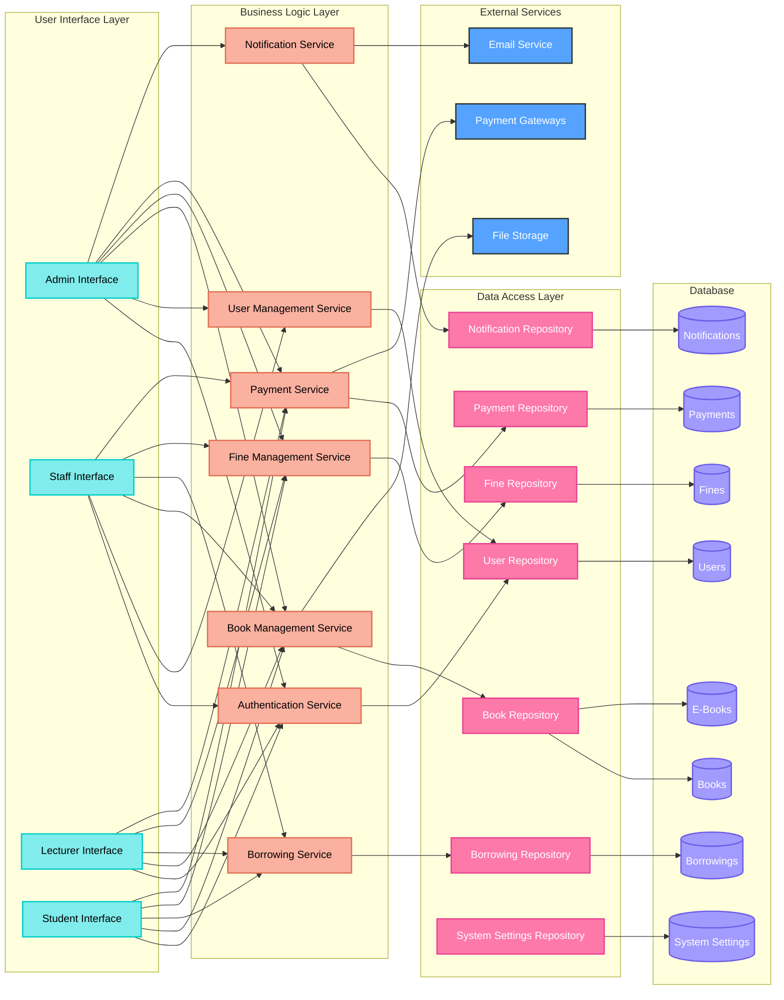
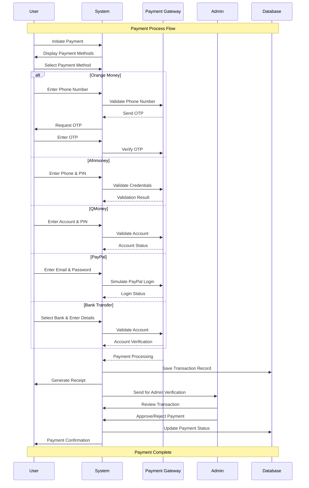
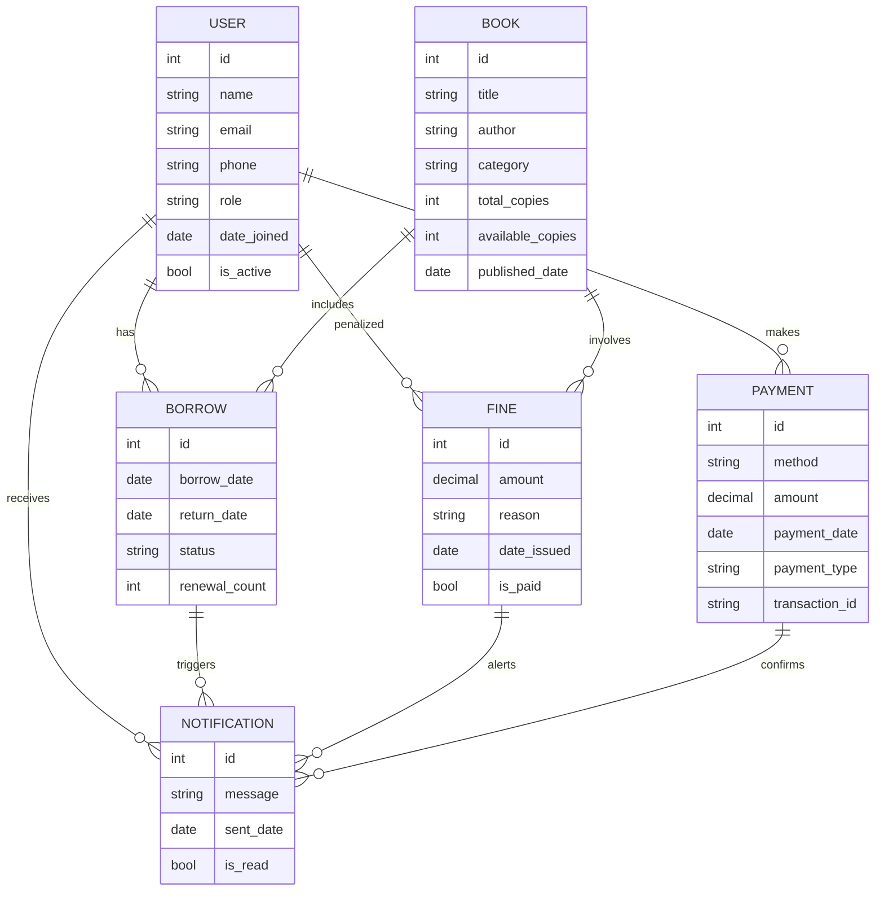

# FBC Library Management System - Simplified Mermaid Flowchart

## System Architecture Overview

## User Journey Flowchart

```mermaid
flowchart TD
    %% User Entry Point
    START([User Visits System]) --> LOGIN[Login Page]
    LOGIN --> AUTH{Authentication}
    AUTH -->|Success| ROLE{Role Check}
    AUTH -->|Failure| LOGIN

    %% Role-based Routing
    ROLE -->|Admin| ADMIN_DASH[Admin Dashboard]
    ROLE -->|Staff| STAFF_DASH[Staff Dashboard]
    ROLE -->|Lecturer| LECTURER_DASH[Lecturer Dashboard]
    ROLE -->|Student| SUB_CHECK{Subscription Active?}

    %% Student Subscription Flow
    SUB_CHECK -->|Yes| STUDENT_DASH[Student Dashboard]
    SUB_CHECK -->|No| SUB_REQUIRED[Subscription Required]
    SUB_REQUIRED --> PAYMENT_FLOW[Payment Process]
    PAYMENT_FLOW --> SUB_SUCCESS{Payment Success?}
    SUB_SUCCESS -->|Yes| STUDENT_DASH
    SUB_SUCCESS -->|No| SUB_REQUIRED

    %% Admin User Journey
    ADMIN_DASH --> ADMIN_ACTIONS{Admin Actions}
    ADMIN_ACTIONS -->|User Management| USER_CRUD[Create/Edit/Delete Users]
    ADMIN_ACTIONS -->|Book Management| BOOK_CRUD[Manage Books & E-books]
    ADMIN_ACTIONS -->|System Config| SYS_CONFIG[Configure System Settings]
    ADMIN_ACTIONS -->|Reports| REPORTS[Generate Reports]
    ADMIN_ACTIONS -->|Verify Payments| PAY_VERIFY[Payment Verification]

    %% Staff User Journey
    STAFF_DASH --> STAFF_ACTIONS{Staff Actions}
    STAFF_ACTIONS -->|Process Returns| RETURN_PROCESS[Book Return Processing]
    STAFF_ACTIONS -->|Approve Requests| APPROVE_REQ[Approve Borrow Requests]
    STAFF_ACTIONS -->|Manage Fines| FINE_MGT[Fine Management]
    STAFF_ACTIONS -->|Limited User Mgmt| LIMITED_USER[Manage Students/Lecturers]

    %% Lecturer User Journey
    LECTURER_DASH --> LEC_ACTIONS{Lecturer Actions}
    LEC_ACTIONS -->|Browse Books| BROWSE_BOOKS[Browse Book Catalog]
    LEC_ACTIONS -->|Read E-books| READ_EBOOK[Online E-book Reading]
    LEC_ACTIONS -->|Borrow Request| BORROW_REQ[Submit Borrow Request]
    LEC_ACTIONS -->|Pay Fines| PAY_FINE[Fine Payment Process]
    LEC_ACTIONS -->|View History| VIEW_HISTORY[Borrowing History]

    %% Student User Journey
    STUDENT_DASH --> STU_ACTIONS{Student Actions}
    STU_ACTIONS -->|Browse Books| BROWSE_BOOKS
    STU_ACTIONS -->|Read E-books| READ_EBOOK
    STU_ACTIONS -->|Borrow Request| BORROW_REQ
    STU_ACTIONS -->|Pay Fines| PAY_FINE
    STU_ACTIONS -->|Manage Subscription| MANAGE_SUB[Subscription Management]
    STU_ACTIONS -->|Payment History| PAY_HISTORY[View Payment History]

    %% Borrow Request Process
    BORROW_REQ --> CHECK_STOCK{Book Available?}
    CHECK_STOCK -->|Yes| SUBMIT_REQ[Submit Request to Staff]
    CHECK_STOCK -->|No| STOCK_NOTIFY[Stock Unavailable Notice]
    
    SUBMIT_REQ --> STAFF_REVIEW{Staff Review}
    STAFF_REVIEW -->|Approved| ASSIGN_DUE[Assign Due Date]
    STAFF_REVIEW -->|Rejected| REJECT_NOTICE[Rejection Notice]
    
    ASSIGN_DUE --> BOOK_BORROWED[Book Status: Borrowed]
    BOOK_BORROWED --> DUE_REMINDER[Due Date Reminders]
    DUE_REMINDER --> RETURN_CHECK{Returned on Time?}
    RETURN_CHECK -->|Yes| RETURN_SUCCESS[Return Successful]
    RETURN_CHECK -->|No| CALCULATE_FINE[Calculate Overdue Fine]
    CALCULATE_FINE --> FINE_NOTIFY[Fine Notification]

    %% Payment Process Detail
    PAYMENT_FLOW --> SELECT_METHOD{Select Payment Method}
    SELECT_METHOD -->|Orange Money| ORANGE_FLOW[Phone + OTP Verification]
    SELECT_METHOD -->|Afrimoney| AFRI_FLOW[Phone + PIN Verification]
    SELECT_METHOD -->|QMoney| Q_FLOW[Account + PIN Verification]
    SELECT_METHOD -->|PayPal| PP_FLOW[Email + Password Simulation]
    SELECT_METHOD -->|Bank Transfer| BANK_FLOW[Account + Reference Number]

    ORANGE_FLOW --> PROCESS_PAYMENT[Process Transaction]
    AFRI_FLOW --> PROCESS_PAYMENT
    Q_FLOW --> PROCESS_PAYMENT
    PP_FLOW --> PROCESS_PAYMENT
    BANK_FLOW --> PROCESS_PAYMENT

    PROCESS_PAYMENT --> GENERATE_RECEIPT[Generate Receipt]
    GENERATE_RECEIPT --> ADMIN_VERIFY[Admin Verification Required]
    ADMIN_VERIFY --> PAYMENT_COMPLETE[Payment Complete]

    %% Return to Dashboard
    USER_CRUD --> ADMIN_DASH
    BOOK_CRUD --> ADMIN_DASH
    SYS_CONFIG --> ADMIN_DASH
    REPORTS --> ADMIN_DASH
    PAY_VERIFY --> ADMIN_DASH

    RETURN_PROCESS --> STAFF_DASH
    APPROVE_REQ --> STAFF_DASH
    FINE_MGT --> STAFF_DASH
    LIMITED_USER --> STAFF_DASH

    BROWSE_BOOKS --> LECTURER_DASH
    READ_EBOOK --> LECTURER_DASH
    VIEW_HISTORY --> LECTURER_DASH

    MANAGE_SUB --> STUDENT_DASH
    PAY_HISTORY --> STUDENT_DASH

    RETURN_SUCCESS --> LECTURER_DASH
    RETURN_SUCCESS --> STUDENT_DASH
    FINE_NOTIFY --> PAY_FINE
    PAYMENT_COMPLETE --> STUDENT_DASH

    %% Styling for User Journey
    classDef startEnd fill:#e17055,stroke:#d63031,stroke-width:3px,color:#fff
    classDef process fill:#74b9ff,stroke:#0984e3,stroke-width:2px,color:#fff
    classDef decision fill:#fdcb6e,stroke:#e84393,stroke-width:2px,color:#000
    classDef adminAction fill:#ff6b6b,stroke:#d63031,stroke-width:2px,color:#fff
    classDef staffAction fill:#4ecdc4,stroke:#00b894,stroke-width:2px,color:#fff
    classDef lecturerAction fill:#45b7d1,stroke:#0984e3,stroke-width:2px,color:#fff
    classDef studentAction fill:#96ceb4,stroke:#00b894,stroke-width:2px,color:#fff

    class START startEnd
    class AUTH,ROLE,SUB_CHECK,ADMIN_ACTIONS,STAFF_ACTIONS,LEC_ACTIONS,STU_ACTIONS,CHECK_STOCK,STAFF_REVIEW,RETURN_CHECK,SELECT_METHOD decision
    class LOGIN,PAYMENT_FLOW,BORROW_REQ,PROCESS_PAYMENT,GENERATE_RECEIPT process
    class ADMIN_DASH,USER_CRUD,BOOK_CRUD,SYS_CONFIG,REPORTS,PAY_VERIFY adminAction
    class STAFF_DASH,RETURN_PROCESS,APPROVE_REQ,FINE_MGT,LIMITED_USER staffAction
    class LECTURER_DASH,BROWSE_BOOKS,READ_EBOOK,VIEW_HISTORY lecturerAction
    class STUDENT_DASH,MANAGE_SUB,PAY_HISTORY studentAction
```

## System Data Flow

## Payment System Workflow

## Enhanced ER Diagram for FBC Library Management System

This documentation provides a simplified version of the FBC Library Management System flowcharts, focusing on key components and user journeys for easier understanding and compatibility with various rendering tools.
