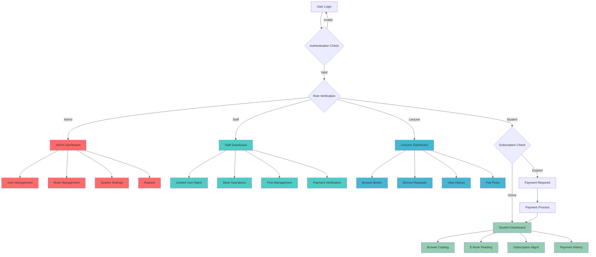
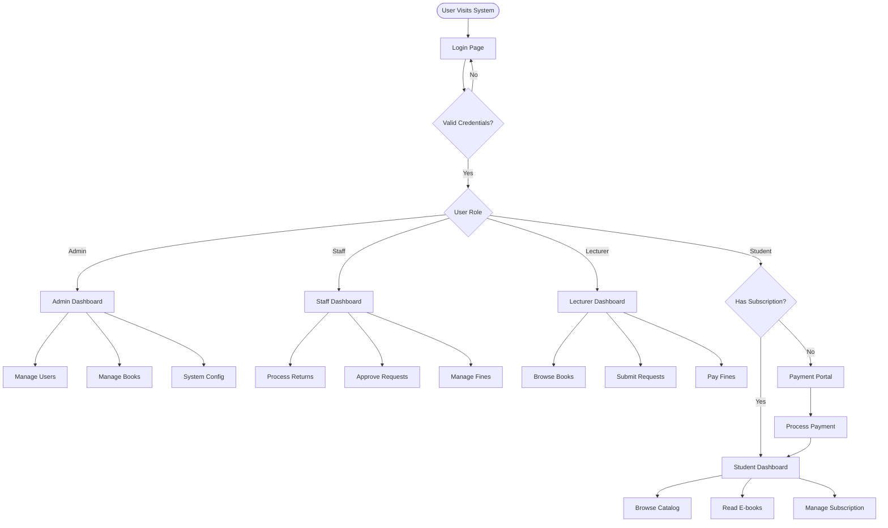
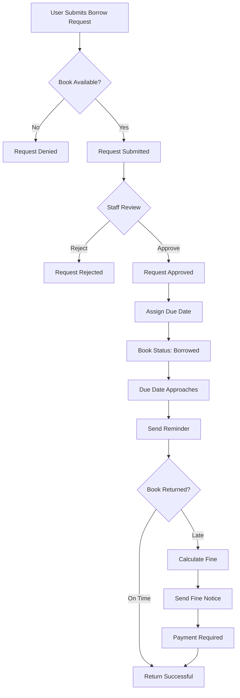
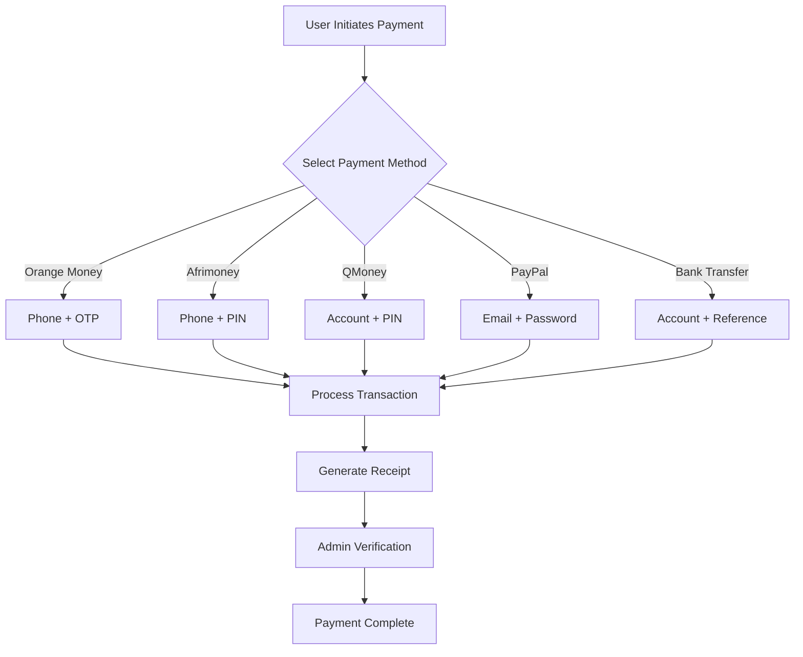
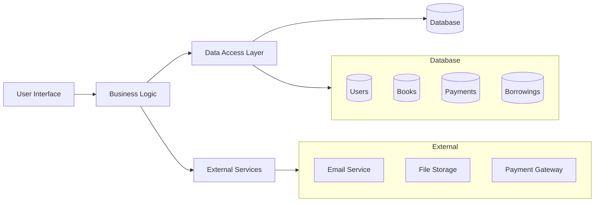
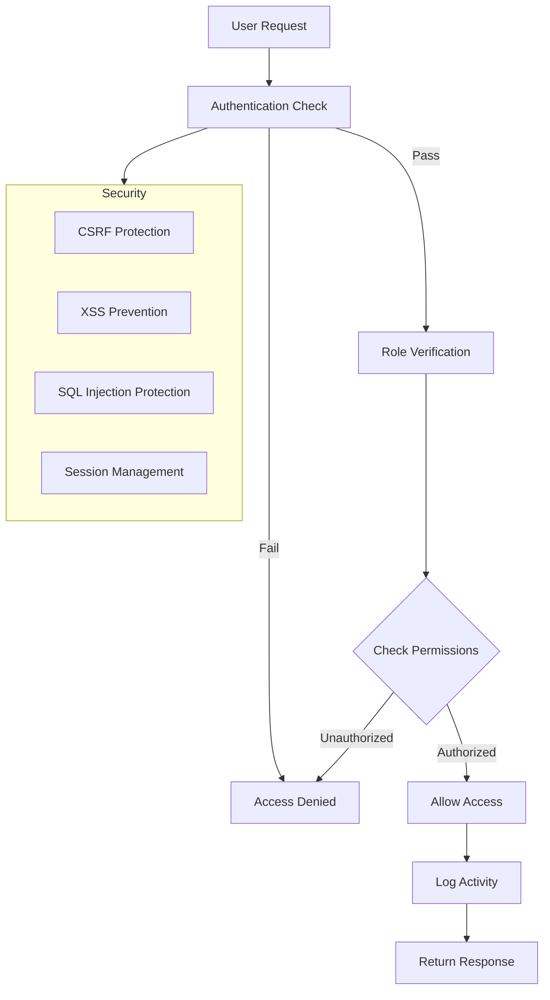
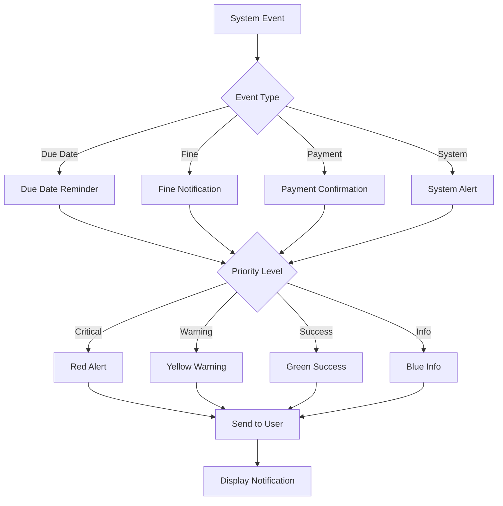
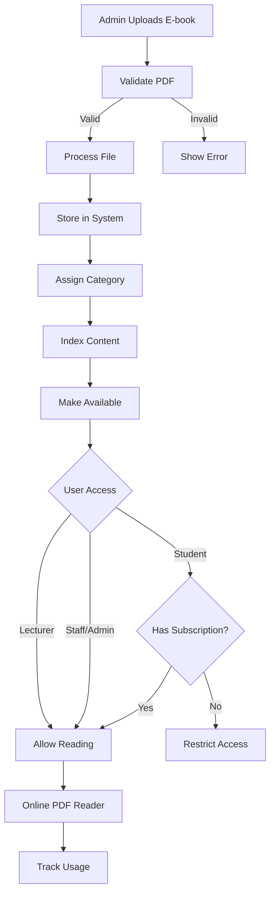

# FBC Library Management System - Working Mermaid Flowcharts

## 1. System Architecture Overview

## 2. User Journey Flow

## 3. Book Borrowing Process

## 4. Payment Processing Flow

## 5. System Data Flow

## 6. Security and Access Control

## 7. Notification System

## 8. E-Book Management

